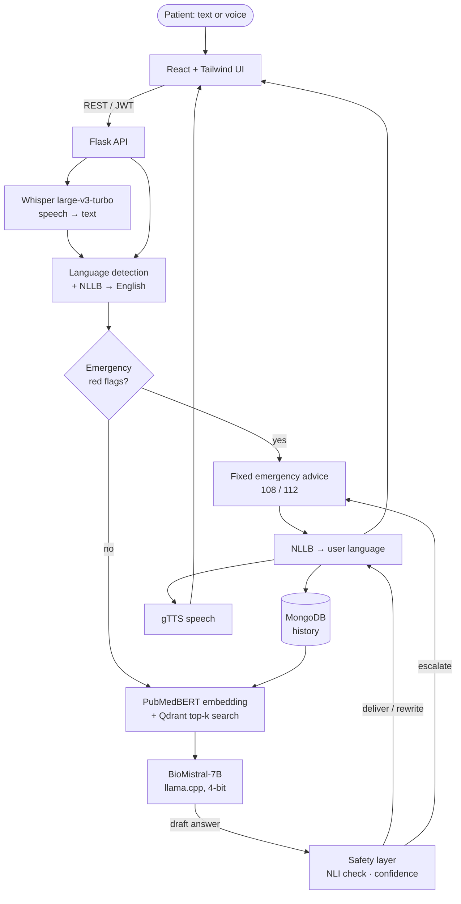
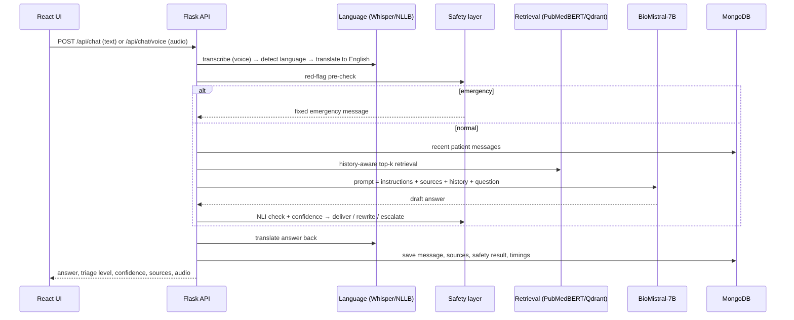

# MedRAG+

**A multilingual, voice-enabled, safety-guarded healthcare triage assistant.**

MedRAG+ answers health questions in **English, Hindi and Telugu**, by text or voice. It
grounds every answer in trusted medical references using Retrieval-Augmented Generation
(RAG) with **BioMistral-7B**, and puts every answer through a **safety layer** that can block
unsupported claims and escalate emergencies before anything reaches the user.

It extends the IEEE paper *"Healthcare Diagnostic RAG-Based Chatbot Triage Enabled by
BioMistral-7B"* (Sinha et al., EmergIN 2024, DOI
[10.1109/EMERGIN63207.2024.10961136](https://doi.org/10.1109/EMERGIN63207.2024.10961136)).

> ⚠️ **MedRAG+ is an academic prototype for triage guidance. It does not diagnose and is not
> clinically validated.** The red-flag rules, thresholds and Hindi/Telugu safety messages
> must be reviewed by clinicians and native speakers before any real-world use. In an
> emergency, call 108 / 112.

---

## Contents

1. [What MedRAG+ does](#1-what-medrag-does)
2. [Enhancements over the base paper](#2-enhancements-over-the-base-paper)
3. [Architecture](#3-architecture)
4. [Technology stack](#4-technology-stack)
5. [Getting started (step by step)](#5-getting-started-step-by-step)
6. [Using the app](#6-using-the-app)
7. [Configuration](#7-configuration)
8. [Testing and evaluation](#8-testing-and-evaluation)
9. [Project structure](#9-project-structure)
10. [Troubleshooting](#10-troubleshooting)
11. [Credits](#11-credits)

---

## 1. What MedRAG+ does

* A patient types or speaks a question, such as *"I have had a cough for three weeks"* or *"मुझे सीने में दर्द है"*.
* The question is transcribed (Whisper), translated to English (NLLB) and checked against **emergency red flags**. An emergency gets immediate advice to call 108/112, without waiting for the language model.
* Otherwise, relevant passages are retrieved from a medical knowledge base (MedlinePlus + WHO) and **BioMistral-7B** writes a draft answer using only those passages.
* The **safety layer** checks every sentence of the draft against the sources, scores confidence, and then **delivers**, **rewrites** (removes unsupported sentences) or **escalates** to "please see a doctor".
* The answer is translated back to the user's language, shown with a **triage level** (self-care / GP / urgent care / emergency) and its **sources**, and read aloud (gTTS).
* Conversations are saved per user (MongoDB), and every message stores the draft, sources, safety scores and per-stage timings for auditing.

## 2. Enhancements over the base paper

| Area | Base paper (Sinha et al. 2024) | MedRAG+ |
|---|---|---|
| RAG core | BioMistral-7B + PubMedBERT + Qdrant + LangChain conversational retrieval | **Kept.** Every chunk now carries source metadata (source, title, URL, section, page), shown to the user |
| Knowledge base | Merck Manual, Harrison's, Oxford Handbook, Gale Encyclopedia (proprietary) | Openly licensed **MedlinePlus** (US NLM, public domain) + **WHO fact sheets**: 6,097 chunks ([details](docs/DATA_SOURCES.md)) |
| Languages | English only | **English, Hindi, Telugu**: Unicode-script language detection + NLLB-200 translation |
| Voice | Voice input only (browser speech recognition) | **Voice in** (Whisper large-v3-turbo, restricted to en/hi/te) **and voice out** (gTTS) |
| Answer safety | LLM output shown directly | **Mandatory safety layer**: emergency red flags, NLI hallucination check, confidence score, deliver / rewrite / escalate |
| Emergencies | Not handled | Rule-based red-flag classifier (English + native Hindi/Telugu keywords) runs **before** the LLM; fixed, pre-translated emergency advice in about 1–2 s |
| Escalation | None | Doctor / emergency / mental-health-crisis messages (108, 112, Tele-MANAS 14416), written per language rather than machine-translated |
| Triage output | None | Four levels: self-care, GP appointment, urgent care, emergency |
| Conversation | History passed to the LLM | History-aware retrieval (follow-up + standalone search, merged) without feeding earlier replies back (prevents copying) |
| Evaluation | BLEU / ROUGE on 5 questions, response time | Recall@K / MRR (300 questions), emergency P/R/F1 and triage accuracy/F1 **per language**, hallucination rate, escalation rates, BLEU/ROUGE, **per-stage latency** |
| Engineering | Not described | Environment-driven config, editable YAML safety rules, 59 automated tests, evaluation and diagnosis scripts |

## 3. Architecture

### 3.1 System overview



### 3.2 Offline knowledge-base pipeline

```
MedlinePlus XML / WHO fact sheets / any PDF, TXT, MD, HTML, NXML
   → clean → split into ~1000-character chunks (sentence-aligned, 150-char overlap)
   → PubMedBERT (768-d) → Qdrant collection (cosine distance, HNSW index)
     payload: text, source, title, url, section, page
```

### 3.3 The safety layer (the main contribution)

Every query and every draft answer goes through these checks, in this order:

| # | Check | How | Outcome |
|---|---|---|---|
| 1 | Emergency red flags | Regex rules in [`red_flags.yaml`](backend/config/red_flags.yaml), run on the English translation **and** the original text, with negation handling ("I do *not* have chest pain") | `escalate` immediately, without calling the LLM |
| 2 | Relevant context exists | Best retrieved chunk ≥ `MIN_RETRIEVAL_SCORE` | otherwise `escalate` (no_context) |
| 3 | Hallucination | Each factual sentence is checked by an NLI cross-encoder against 2-sentence windows of the retrieved passages and the patient's own message. Questions and advice ("see a doctor") are not treated as claims | many unsupported → `escalate` |
| 4 | Confidence | Weighted mix of retrieval similarity, BioMistral token probability and grounding of the text to be shown | < `CONFIDENCE_THRESHOLD` → `escalate` |
| 5 | Minor issues | A few unsupported sentences | `rewrite`: removed, and the rest delivered with a note |
| 6 | All checks pass | | `deliver` |

Real example from testing: for *"I have stomach pain"*, BioMistral claimed that sharp pain
on the **left** side could be the **appendix**, which is anatomically wrong. 6 of its 7
sentences were unsupported by the sources, so the answer was blocked and the user was
advised to see a doctor.

### 3.4 Request sequence



## 4. Technology stack

| Layer | Technology | Purpose |
|---|---|---|
| LLM | [BioMistral-7B](https://huggingface.co/BioMistral/BioMistral-7B), GGUF Q4_K_M via [llama.cpp](https://github.com/abetlen/llama-cpp-python) | Medical answer generation on CPU |
| Embeddings | [PubMedBERT](https://huggingface.co/NeuML/pubmedbert-base-embeddings) (768-d) | Semantic search over medical text |
| Vector DB | [Qdrant](https://qdrant.tech/) (embedded on disk, or a Docker server) | Top-k similarity search |
| Translation | [NLLB-200 distilled 600M](https://huggingface.co/facebook/nllb-200-distilled-600M) | Hindi/Telugu ↔ English |
| Speech-to-text | [Whisper large-v3-turbo](https://github.com/SYSTRAN/faster-whisper) via faster-whisper | Multilingual voice input |
| Text-to-speech | [gTTS](https://pypi.org/project/gTTS/) | Spoken answers in en/hi/te |
| Hallucination check | [NLI DeBERTa-v3-xsmall](https://huggingface.co/cross-encoder/nli-deberta-v3-xsmall) cross-encoder | Checks each claim against the sources |
| Backend | Python 3.12, Flask, PyJWT | REST API, authentication, pipeline orchestration |
| Database | MongoDB | Users, sessions, messages, safety flags |
| Frontend | React 19, Vite, Tailwind CSS 4 | Chat UI, mic recording, audio playback |
| Testing | pytest, mongomock, in-memory Qdrant | 59 tests that run without any model weights |

## 5. Getting started (step by step)

### 5.1 Requirements

| | Minimum |
|---|---|
| OS | Windows 10/11, Linux or macOS |
| Python | **3.10–3.12** (3.12 recommended; prebuilt llama.cpp wheels may not exist for 3.13) |
| Node.js | 20 or newer |
| Git | any recent version |
| RAM | 16 GB recommended (all models together use about 8 GB) |
| Disk | about **15 GB** free (about 10 GB of models, 3 GB Python packages, data) |
| GPU | Not required. Everything runs on CPU, but a typical answer then takes 30–60 s |
| Internet | Needed for setup downloads, and at runtime for gTTS voice replies |

### 5.2 Clone the repository

```bash
git clone https://github.com/Nithish-Chandra-Devarashetty/medragplus.git
cd medragplus
```

### 5.3 Create a Python virtual environment and install dependencies

**Windows (PowerShell)**

```powershell
python -m venv .venv
.venv\Scripts\Activate.ps1
# If activation is blocked:  Set-ExecutionPolicy -Scope CurrentUser RemoteSigned
python -m pip install --upgrade pip
pip install torch --index-url https://download.pytorch.org/whl/cpu
pip install -r requirements.txt --extra-index-url https://abetlen.github.io/llama-cpp-python/whl/cpu
```

**Linux / macOS**

```bash
python3 -m venv .venv
source .venv/bin/activate
python -m pip install --upgrade pip
pip install torch --index-url https://download.pytorch.org/whl/cpu     # macOS: pip install torch
pip install -r requirements.txt --extra-index-url https://abetlen.github.io/llama-cpp-python/whl/cpu
```

> Keep the virtual environment activated (you'll see `(.venv)` in the prompt) for all
> the Python commands below.

### 5.4 Set up MongoDB

Choose **one** option:

* **A. Install MongoDB Community Server** from https://www.mongodb.com/try/download/community. On Windows it runs as a service automatically at `mongodb://localhost:27017`.
* **B. Docker:** `docker compose up -d mongo`
* **C. No install (quick trial):** set `MONGO_URI=mongomock://` in `.env` in the next step. Data is kept in memory and lost on restart.

### 5.5 Create the configuration file

```bash
# Windows:  copy .env.example .env        Linux/macOS:  cp .env.example .env
python -c "import secrets; print(secrets.token_hex(32))"
```

Open `.env` and paste the printed value into `SECRET_KEY=`. The defaults work for
everything else. See [Configuration](#7-configuration).

### 5.6 Download the models (about 10 GB, one time)

```bash
python scripts/download_models.py
```

This fetches BioMistral-7B (GGUF, about 4.4 GB, saved to `models/`), PubMedBERT, NLLB-200,
the NLI checker and Whisper large-v3-turbo. Expect 10–40 minutes depending on your connection.

### 5.7 Download the knowledge base

```bash
python scripts/download_data.py
```

This downloads MedlinePlus health topics (about 30 MB), about 240 WHO fact sheets and the
MedQuAD evaluation set into `data/`.

### 5.8 Build the vector index (one time)

```bash
python scripts/ingest.py
```

This chunks the documents, embeds them with PubMedBERT and stores them in Qdrant
(`data/qdrant/`). It takes about **15–25 minutes on a laptop CPU** and should finish with
roughly 6,000 chunks.

### 5.9 (Optional) Run the tests

```bash
pytest
```

All 59 tests should pass in a few seconds. They don't need the models.

### 5.10 Start the backend

```bash
python -m backend.app
```

Wait until you see `Models loaded` and `Running on http://127.0.0.1:5000` (1–2 minutes the
first time). Check it at http://127.0.0.1:5000/api/health: `knowledge_chunks` should be
about 6000.

### 5.11 Start the frontend (in a second terminal)

```bash
cd frontend
npm install
npm run dev
```

### 5.12 Open the app

Go to **http://localhost:5173**, register an account (pick your preferred language), and
start chatting.

> **Next time** you only need step 5.10 (with the venv activated) and `npm run dev` in
> `frontend/`. Steps 5.3–5.8 are one-time setup.

## 6. Using the app

* **Language selector:** choose English / हिन्दी / తెలుగు. *Auto* works for typed text. For **voice, select your language explicitly**, because Whisper's automatic language detection often mistakes Telugu for Hindi.
* **🎤 Mic:** click to record, click again to send. Allow microphone access in the browser.
* **🔊 Play:** reads the answer aloud. The "Auto-speak replies" toggle plays answers automatically.
* **Each answer shows:**
  * a triage badge
  * a confidence bar
  * **Sources:** the passages used
  * **Safety details:** the action taken, flags, any unsupported claims removed, and per-stage timings
* **Be patient:** on a CPU-only laptop, answers take about 30–60 s, and voice adds about 20 s. Emergencies are answered in about 1–2 s.
* **"Please consult a doctor" replies** mean the safety layer withheld an answer it couldn't verify against the sources. This is intentional.

## 7. Configuration

All settings live in `.env` (documented in [`.env.example`](.env.example)). The important ones:

| Setting | Default | Meaning |
|---|---|---|
| `MONGO_URI` | `mongodb://localhost:27017` | `mongomock://` for in-memory |
| `QDRANT_URL` / `QDRANT_PATH` | empty / `data/qdrant` | Qdrant server URL, or embedded on-disk index |
| `LLM_MODEL_PATH` | `models/BioMistral-7B.Q4_K_M.gguf` | Any BioMistral GGUF quantisation |
| `LLM_N_THREADS` | `8` | Set to your number of physical CPU cores |
| `TOP_K`, `LLM_CONTEXT_CHARS_PER_CHUNK` | `3`, `700` | Prompt size. The biggest lever on CPU latency |
| `WHISPER_MODEL` | `large-v3-turbo` | `small` is about 10× faster but cannot transcribe Telugu |
| `CONFIDENCE_THRESHOLD` | `0.70` | Below this, answers are escalated |
| `ENTAILMENT_THRESHOLD`, `NLI_WINDOW_SENTENCES` | `0.5`, `2` | Hallucination-check strictness |
| `MAX_UNSUPPORTED_RATIO_FOR_REWRITE` | `0.34` | Above this share of unsupported claims, escalate instead of rewrite |
| `TTS_BACKEND` | `gtts` | `none` to disable (the UI falls back to browser speech) |

The safety rules and messages are plain YAML that can be edited without touching code:

* [`red_flags.yaml`](backend/config/red_flags.yaml): emergency symptoms
* [`triage_rules.yaml`](backend/config/triage_rules.yaml): urgent care / GP rules
* [`messages.yaml`](backend/config/messages.yaml): escalation texts in en/hi/te

## 8. Testing and evaluation

```bash
pytest                                              # 59 unit + API tests, no models needed
python scripts/evaluate.py retrieval --n 300        # Recall@K and MRR on MedQuAD questions
python scripts/evaluate.py safety                   # emergency + triage accuracy per language
python scripts/evaluate.py e2e --medquad 10         # full pipeline incl. BioMistral (~30 min on CPU)
python scripts/diagnose.py "your question"          # trace one query: sources, draft, NLI scores
```

Results are saved to `eval/results/`. The labelled test set is
[`eval/data/triage_cases.jsonl`](eval/data/triage_cases.jsonl): 33 English cases plus 11
Hindi and 11 Telugu.

### Measured results

Measured on an Intel i5-13420H laptop, CPU only, with BioMistral-7B Q4_K_M.

| Metric | Result |
|---|---|
| Knowledge base | 6,097 chunks (MedlinePlus 2,808 + WHO 3,309) |
| Retrieval, 300 MedQuAD questions | Recall@1 0.84 · Recall@3 0.92 · Recall@5 0.93 · Recall@10 0.96 · MRR 0.89 |
| Emergency detection (55 cases, en/hi/te) | Precision 1.00 · Recall 1.00 in every language |
| Triage accuracy, full pipeline | 0.93 (English 0.91, Hindi 0.91, Telugu 1.00) |
| Emergencies escalated | 100%, in about 1–2 s, with no LLM call |
| Generated answers with ≥1 unsupported claim | 40% (removed or escalated by the safety layer) |
| Non-emergency questions escalated | 57% (conservative by design; tunable) |
| ROUGE-1 / ROUGE-L on answered MedQuAD questions | 0.34 / 0.26 |
| Latency, typed question | mean 31 s · p95 74 s (BioMistral generation ≈ 37 s when it runs) |
| Latency, voice | adds about 15–25 s of Whisper transcription |

**Caveats:**
* The triage and red-flag rules were tuned on the same 55 cases, so those scores are optimistic. A held-out set is needed for publication.
* MedQuAD questions are templated, which inflates retrieval scores.
* NLLB-600M occasionally mistranslates medical terms. One Telugu answer rendered "diarrhea" as "deliveries".

## 9. Project structure

```
medragplus/
├── backend/
│   ├── app.py                  Flask app factory  (python -m backend.app)
│   ├── api/                    /register /login /me /chat /chat/voice /tts /history /health
│   ├── services/
│   │   ├── chat_service.py     end-to-end pipeline (ASR → translate → safety → RAG → LLM → TTS)
│   │   ├── language_service.py language detection + NLLB translation
│   │   ├── speech_service.py   Whisper ASR + gTTS
│   │   ├── retrieval_service.py history-aware retrieval
│   │   ├── generation_service.py prompt building + BioMistral generation
│   │   ├── safety_service.py   SafetyLayer decision engine
│   │   └── container.py        wiring of all components from settings
│   ├── rag/                    embeddings, Qdrant store, ingestion (loaders, chunking), retriever
│   ├── models/biomistral.py    llama.cpp wrapper (+ a fake LLM for tests)
│   ├── safety/                 emergency, triage, confidence, hallucination, escalation
│   ├── config/                 settings.py + editable YAML rules and messages
│   ├── db/store.py             MongoDB: users, sessions, messages, safety_flags
│   └── evaluation/metrics.py   Recall@K, MRR, P/R/F1, BLEU, ROUGE, latency stats
├── frontend/                   React + Tailwind UI (Vite)
├── scripts/                    download_models, download_data, ingest, evaluate, diagnose
├── eval/data/                  labelled triage cases (en/hi/te)
├── tests/                      pytest suite
├── docs/API.md                 REST API reference
├── docs/DATA_SOURCES.md        knowledge sources and licences
├── .env.example                all configuration options
├── requirements.txt            full Python dependencies
└── docker-compose.yml          optional MongoDB + Qdrant servers
```

Not in the repository (created by the setup steps): `models/`, `data/`, `.venv/`,
`frontend/node_modules/`, `.env`.

## 10. Troubleshooting

| Problem | Fix |
|---|---|
| `Storage folder data/qdrant is already accessed by another instance` | Embedded Qdrant allows one process at a time. Stop the backend before running `ingest.py` or `evaluate.py`, or use the Qdrant server (`docker compose up -d qdrant`, then set `QDRANT_URL=http://localhost:6333` and re-run `ingest.py`) |
| `ServerSelectionTimeoutError` (MongoDB) | MongoDB isn't running. Start the service, or set `MONGO_URI=mongomock://` |
| `open() got an unexpected keyword argument 'metadata_errors'` (voice) | PyAV is too new for faster-whisper: `pip install "av<15"` |
| `BioMistral GGUF not found` | Run `python scripts/download_models.py --llm` |
| `knowledge_chunks: 0` in /api/health | Run `python scripts/ingest.py` with the backend stopped |
| No voice reply | gTTS needs internet. The UI falls back to the browser's speech synthesis |
| Voice transcribed in the wrong language | Select the language explicitly in the selector instead of *Auto* |
| `Port 5173 is already in use` | Another Vite server is running. Close it or use `npm run dev -- --port 5174` |
| Very slow answers | Expected on CPU. Reduce `TOP_K` / `LLM_MAX_TOKENS`, or run on a machine with an NVIDIA GPU |
| Hugging Face "symlinks" warning on Windows | Harmless. Hide it with `HF_HUB_DISABLE_SYMLINKS_WARNING=1` |

## 11. Credits

**Team**

* A. Rikin
* Ch. Vaibhav Reddy
* Ch. Eshwar
* D. Nithish Chandra Azad

**Base paper:** K. Sinha, V. Singh, A. Vishnoi, P. Madan, Y. Shukla, *"Healthcare Diagnostic RAG-Based Chatbot Triage Enabled by BioMistral-7B"*, IEEE EmergIN 2024.

**Models:**

* BioMistral (Labrak et al., 2024)
* PubMedBERT (NeuML)
* NLLB-200 (Meta AI)
* Whisper (OpenAI) via faster-whisper (SYSTRAN)
* DeBERTa-v3 NLI cross-encoder (sentence-transformers)

**Data:**

* MedlinePlus (U.S. National Library of Medicine)
* WHO fact sheets (CC BY-NC-SA 3.0 IGO)
* MedQuAD (Ben Abacha & Demner-Fushman, CC BY 4.0)
